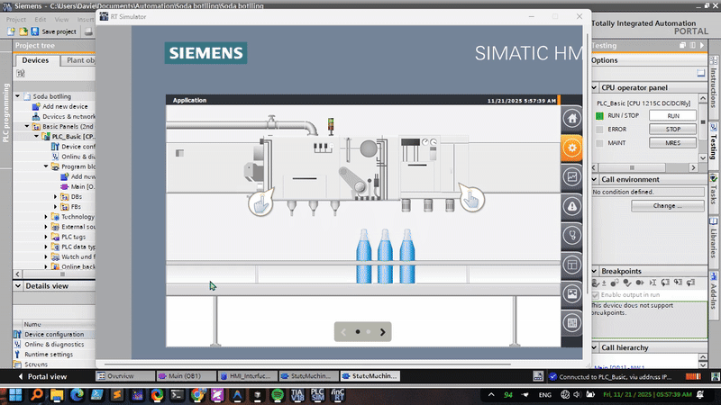

# Soda Bottling System - TIA Portal V18

## Overview

This project implements an automated soda bottling system using Siemens TIA Portal V18. The system provides comprehensive control and monitoring capabilities for a complete bottling production line, including filling, capping, labeling, and quality control processes.

## System Visualization

*System overview diagram showing the complete bottling line layout with all stations and components*

*Animated demonstration of the soda bottling system in operation, showing the automated process from bottle feeding through filling, capping, and packaging*

## Key Features

- **Automated Bottling Process**: Complete automation from bottle feeding to final packaging
- **Real-time Monitoring**: HMI interface for system status and production metrics
- **Quality Control**: Integrated sensors and validation systems
- **Alarm Management**: Comprehensive alarm logging and notification system
- **Production Analytics**: Data logging and reporting capabilities
- **Safety Systems**: Emergency stop and safety interlocks
- **Flexible Operation**: Manual, semi-automatic, and fully automatic modes

## System Requirements

### Software
- **TIA Portal V18** or higher
- **Windows 10/11** (64-bit)
- **Siemens Step 7** and **WinCC** (included with TIA Portal)

### Hardware
- Compatible Siemens PLC (S7-1200, S7-1500 series)
- HMI Panel (SIMATIC HMI panels)
- Industrial network infrastructure
- Field devices (sensors, actuators, motors)

## Installation & Setup

1. **Install TIA Portal V18** with all required components
2. **Open the Project**: Launch TIA Portal V18 and open `Soda botlling.ap18`
3. **Configure Hardware**: Set up PLC and HMI panel in device configuration
4. **Download to Hardware**: Compile and download PLC program and HMI project
5. **Commission System**: Perform system checks, calibrate sensors, and test safety functions

## Usage

### Starting the System
1. Power on all system components
2. Navigate to the main HMI screen
3. Select operation mode (Manual/Semi-Auto/Auto)
4. Press "Start" to begin bottling process

### Operation Modes
- **Manual Mode**: Individual control for testing and maintenance
- **Semi-Automatic Mode**: Operator-assisted with automated sequences
- **Automatic Mode**: Fully automated production

## Technical Details

- **Control Logic**: Structured programming using Function Blocks (FBs) and Functions (FCs) with state machine implementation
- **HMI Features**: Touch-screen interface with real-time visualization, alarm management, and production reporting
- **Communication**: Industrial Ethernet with data logging and archiving

## Safety Considerations

⚠️ **Important Safety Notes:**
- Follow proper lockout/tagout procedures before maintenance
- Ensure all safety interlocks are functioning properly
- Regular testing of emergency stop circuits
- Operator training on system operation and safety procedures

---

**Note**: This project requires TIA Portal V18 or compatible version. Ensure you have appropriate software licenses before use.
