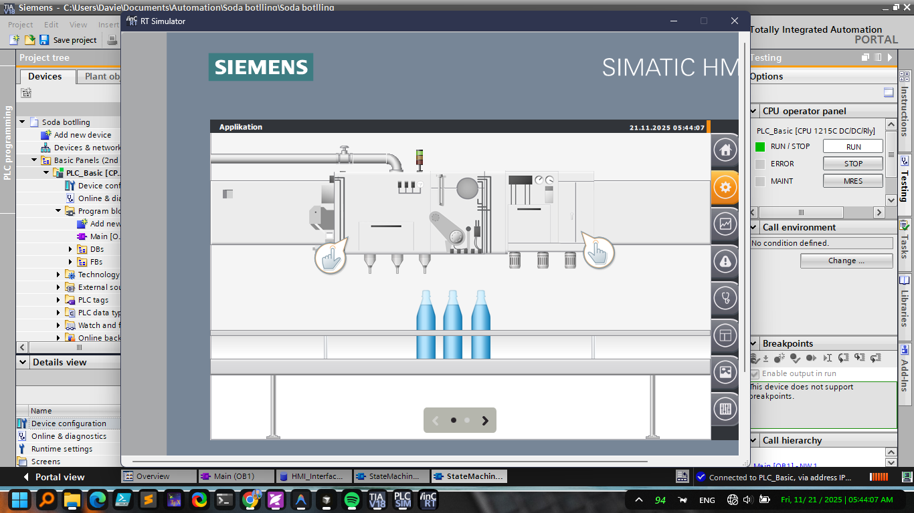

# Soda Bottling System - TIA Portal V18

## Overview

This project implements an automated soda bottling system using Siemens TIA Portal V18. The system provides comprehensive control and monitoring capabilities for a complete bottling production line, including filling, capping, labeling, and quality control processes.

## Project Description

The Soda Bottling System is an industrial automation solution designed to streamline and optimize the bottling process. The system integrates PLC (Programmable Logic Controller) programming with HMI (Human Machine Interface) visualization to create a robust, user-friendly automation platform.

### Key Features

- **Automated Bottling Process**: Complete automation of the bottling line from bottle feeding to final packaging
- **Real-time Monitoring**: HMI interface for real-time system status and production metrics
- **Quality Control**: Integrated sensors and validation systems to ensure product quality
- **Alarm Management**: Comprehensive alarm logging and notification system
- **Production Analytics**: Data logging and reporting capabilities
- **Safety Systems**: Emergency stop and safety interlocks for operator protection
- **Flexible Operation**: Manual, semi-automatic, and fully automatic operation modes

## System Architecture

The system is built using:
- **TIA Portal V18**: Siemens Totally Integrated Automation Portal
- **PLC Programming**: Structured control logic for process automation
- **HMI Interface**: Touch-screen visualization for operator interaction
- **Industrial Communication**: Ethernet-based communication protocols

## Project Structure

```
Soda botlling/
├── AdditionalFiles/          # Additional project files and archives
├── IM/                       # Installation Manager files
│   ├── HMI/                  # HMI project files
│   └── SearchIndex/          # Search index files
├── images/                   # Project images and illustrations
├── Logs/                     # System logs and conversion logs
├── System/                   # System configuration files
├── UserFiles/                # User-defined files
└── Soda botlling.ap18        # Main TIA Portal project file
```

## System Requirements

### Software
- **TIA Portal V18** or higher
- **Windows 10/11** (64-bit)
- **Siemens Step 7** (included with TIA Portal)
- **WinCC** (for HMI development)

### Hardware
- Compatible Siemens PLC (e.g., S7-1200, S7-1500 series)
- HMI Panel (e.g., SIMATIC HMI panels)
- Industrial network infrastructure
- Field devices (sensors, actuators, motors, etc.)

## Installation & Setup

1. **Install TIA Portal V18**
   - Ensure you have a valid license for TIA Portal V18
   - Install all required components (Step 7, WinCC, etc.)

2. **Open the Project**
   - Launch TIA Portal V18
   - Open the project file: `Soda botlling.ap18`

3. **Hardware Configuration**
   - Configure your PLC hardware in the device configuration
   - Set up network parameters and communication settings
   - Configure HMI panel settings

4. **Download to Hardware**
   - Compile the project to check for errors
   - Download the PLC program to your controller
   - Download the HMI project to your panel

5. **System Commissioning**
   - Perform initial system checks
   - Calibrate sensors and actuators
   - Test all safety functions
   - Run production tests

## Usage

### Starting the System

1. Power on all system components
2. Navigate to the main HMI screen
3. Select the desired operation mode (Manual/Auto)
4. Press the "Start" button to begin the bottling process

### Operation Modes

- **Manual Mode**: Individual control of each station for testing and maintenance
- **Semi-Automatic Mode**: Operator-assisted operation with automated sequences
- **Automatic Mode**: Fully automated production with minimal operator intervention

### Monitoring

- Monitor production statistics on the HMI dashboard
- View real-time system status and alarms
- Access historical data and production reports

## System Illustration



*Figure 1: System overview diagram showing the complete bottling line layout*

## Video Demonstration

<video src="images/soda bottling.mp4" controls autoplay loop muted width="100%">
  Your browser does not support the video tag.
</video>

Video demonstration of the soda bottling system in operation 

## Technical Details

### Control Logic
- Structured programming using Function Blocks (FBs) and Functions (FCs)
- State machine implementation for process control
- Interlocking and safety logic for safe operation

### HMI Features
- Intuitive touch-screen interface
- Real-time data visualization
- Alarm management and acknowledgment
- Production reporting and analytics
- Recipe management for different product types

### Communication
- Industrial Ethernet communication
- OPC UA support (if configured)
- Data logging and archiving

## Maintenance

### Regular Maintenance Tasks
- Periodic calibration of sensors
- Cleaning and inspection of mechanical components
- Software updates and backups
- Review of alarm logs and system performance

### Troubleshooting
- Check alarm logs in the `Logs/` directory
- Review system diagnostics in TIA Portal
- Consult the HMI alarm screen for active faults

## Safety Considerations

⚠️ **Important Safety Notes:**
- Always follow proper lockout/tagout procedures before maintenance
- Ensure all safety interlocks are functioning properly
- Regular testing of emergency stop circuits
- Operator training on system operation and safety procedures

## Version History

- **V18.0**: Initial release on TIA Portal V18
- Project converted from previous TIA Portal versions (V13 → V18)

## License

This project is provided for educational and industrial use. Please ensure compliance with Siemens software licensing requirements.

## Contact & Support

For questions, issues, or contributions related to this project, please refer to your system integrator or Siemens technical support.

## Acknowledgments

Developed using Siemens TIA Portal V18 automation platform.

---

**Note**: This project requires TIA Portal V18 or compatible version to open and modify. Ensure you have the appropriate software licenses before use.

